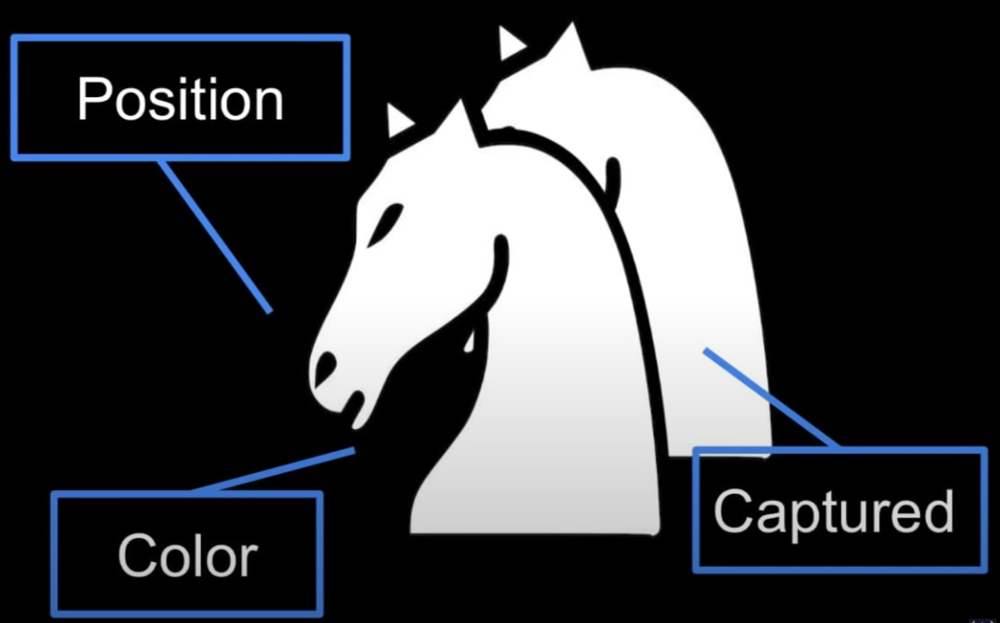
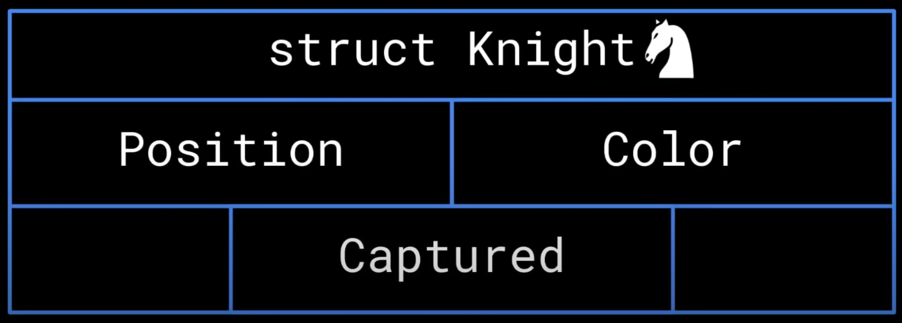
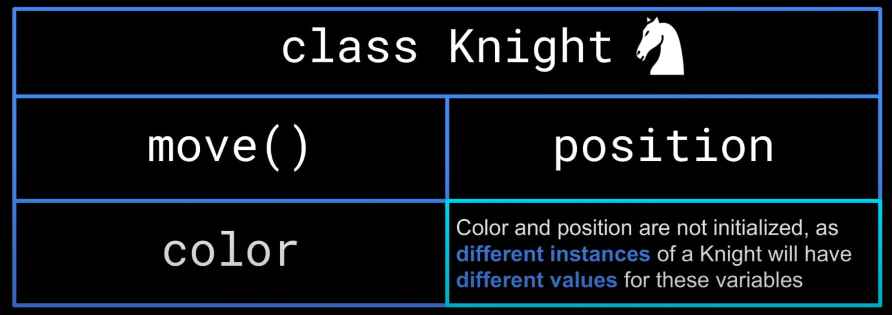

## Object Oriented Programming in a Nutshell
We will talk about what Oject Oriented Programming means, and the four main principles of Object Oriented Programming, using a chess game as an example.

## What is Object Oriented Programming
In order to understand what object oriented programming is, it's best to first understand what `objects` are. Additionally, to understand `objects`, it's best to first understand what *primitive data types* are. 
### Primitive Data
*Primitive data types* store *single* and *simple* values. Examples include: `char`, `int`, `float`, `double`, `boolean`, etc. In the earlier stages of programming, these *primitive* data types are enough for the programs. However, as programs became large and more complex, only using primitive data types wasn't sufficient anymore. Programmers began to need to *group* pieces of data together to represent a specific `object`. 
## Chess Example
For instance, if we want to program a chess game, we need to program a **knight** piece. There are plenty of variables with different types that we need in order to represent a **knight**, including but not limited to:
* A `position` variable to keep track of where the knight is
* A `color` variable to represent whether the knight is white or black
* A `captured` boolean variable to remove the knight from the chess board if captured

Note that we have several more chess pieces other than **knights** which also need several variables to represent, so it is best if there was a way to *group* these variables together. In essence, Grouping related variables together is almost necessary when it comes to complex programs.

### The Structure
The `struct` or the structure data type introduced a way of grouping related variables. In C, `struct` is similar to an array in that it stores many pieces of data together, but `struct` can store data of different types where as the arrays cannot. A `struct` can also store other `struct`. In the chess example, we can now store all the variables that represent a **knight** in a `struct`. 

We can also store both knights into another `struct`. 

The `struct` is the precursor to the object, or so we call **class objects.**

### Downside of structs
The issue that the `struct` had and an issue that objects would come to remedy was that you could not define functions within a `struct`. Thinking about the chess example, we have all the data to represent a **knight**, but we cannot define a function *specific* to the behaviors of a **knight**, such as their move function, within a knight `struct`.

### Object Oriented Programming
When object oriented programming came along, objects can do everything a `struct` can do, and also define functions *specific* to the object, called member functions or member methods. For the chess example, we can define member variables and member methods to represent a knight.

___ 

#### What are Objects?
Objects are **instances of a class**
___
#### What are Classes?
Classes are **templates for objects**
___
#### Difference between Objects and Classes
Let's use the chess example to clarify the difference. The knight `class` represents *any given* knight, and a knight `object` represents *only one* singular knight.

### Conclusion
Object oriented programming helps programmers create complex programs by grouping together relate data and functions. We will continue explaining what object oriented programming is by diving into the details of its four main principles.

## [1. Encapsulation](./encapsulation.md)

## [2. Abstraction](./abstraction.md)

## [3. Inheritance](./inheritance.md)

## [4. Polymorphism](polymorphism.md)

___
Source: [Link](https://www.youtube.com/watch?v=SiBw7os-_zI)