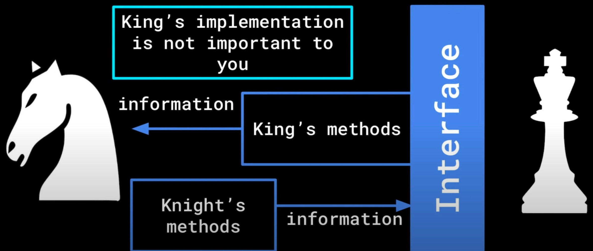

# Abstraction
## Definition: Abstraction refers to **only showing essential details** (having a set interface) and keeping everything else hidden.
___
## Car Example
Let's take driving a car as an example. In order to drive a car, we need to know how to steer the steering wheel to turn the car, and how to press on the gas and brake pedals to move or stop the car. We are not concerned with how the car functions internally. Let's break down this examples into three parts: input, process, and output.
```
Input - Steer the sterring wheel, Press on Gas Pedal

Process - the inner workings of the car

Output - The car turns, the car moves
```
As you can see, we only need to understand the input and output, and the process is not imporotant to us. 

This idea demostrated by the car example should extend to `objects`.

## Abstraction in Classes
Users of you classes should not worry about the inner details of those classes. Abstraction is similar to Encapsulation in that because we want to prevent bugs when the program gets complicated. 

If we want to work on a big program incrementally, or work with multiple other programmers, we need to have every section function correctly with only requiring knowledge of the **Input** and **Output** and not the inner workings on that section. How do we achieve this?

## Interface and Implementation
We can thinkg of our program in turns of **Interface** and **Implementation**. 

Interface - the way sections of code can communicate with one another. This is typically done through methods that each class is able to access.

Implementation - the implementation of these methods, or how these methods are coded, should be hidden within the class and not accessible on the outside. 

## Chess Example
Let's say you are working on the `knight` class, and your friend is working on the `king` class. In order to effectively work together, we need to agree on an **interface** for which these pieces can communicate with each other. 

For the `knight`'s `move()` method, we need to check if the `king` is checked, so we access the `getter()` to check the `status` of the `king`. If we can put the `king` out of check with the `knight`, we need to access the `setter()` to change the `status` of the `king`. Note that how to determine whether the `king` is checked is the **implementation** of the `king`'s class, and we only need the `king`'s **interface** for the `knight` to move. 



## Conclusion
Abstraction prevents entanglement between sections of the program. If classes are entangled, then one change in one section creates a *ripple effect* that requires many more changes in other sections to maintain the functionality of the program.

Creating an **interface** through which classes can interact ensures that each class can be **individually developed** without creating ripple effects. 
