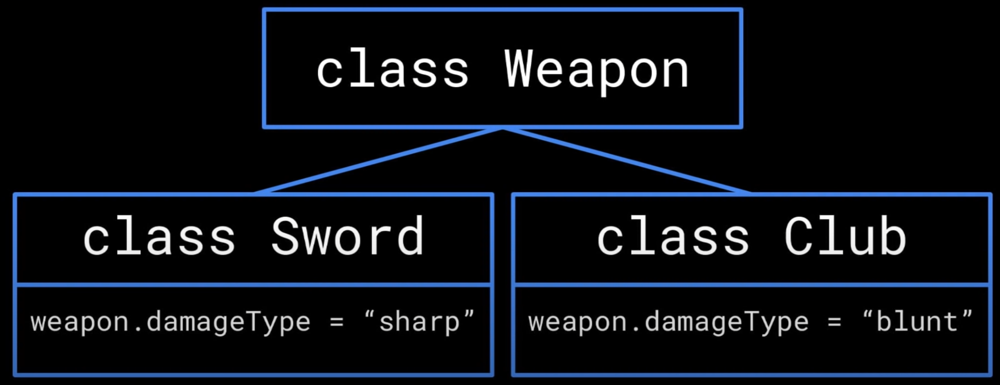
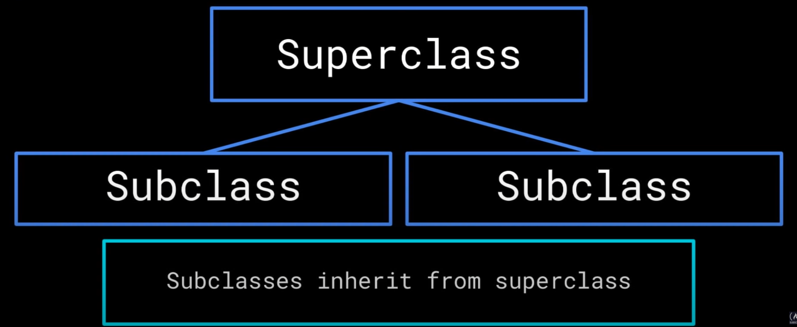
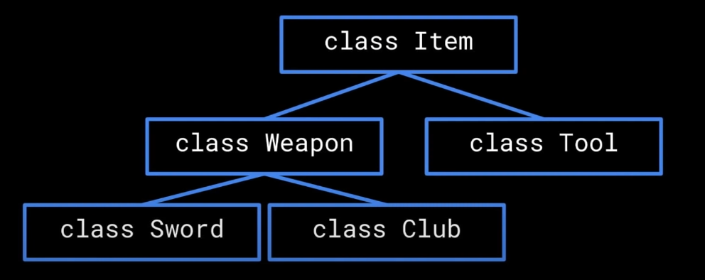
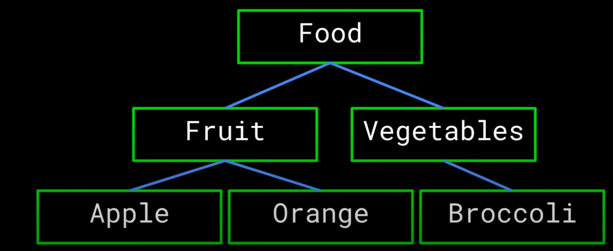
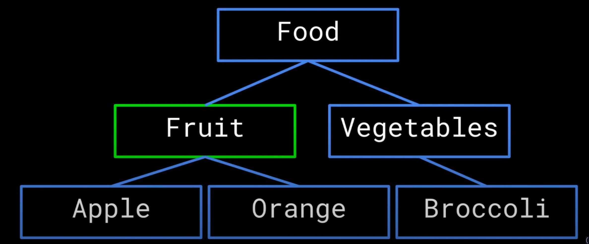
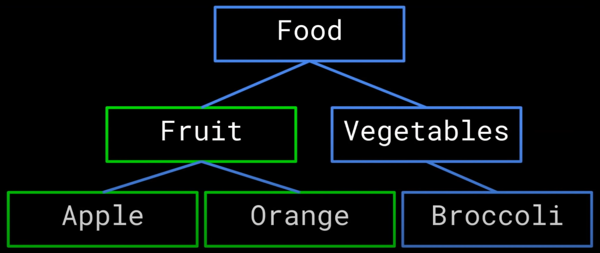

# Inheritance
## Definition: Inheritance is the principle that allows classes to derive from other classes. Classes can *inherit* methods and attributes from another class. 
___
## Weapon Example
Let's say we are programming a medieval RPG game where our player can collect different weapons. To utilize inheritance, we first implement a class called `Weapon`, which contains pertinent methods and attributes that are common to all weapons, like an attribute `damage` representing how much damage the weapon does, and a method `attack()` that uses a weapon to attack enemies. 

We then want to implement seperate classes for the different type of weapons like a `Sword` or `Club` class. Swords and Clubs will have different values for the same attribute, like a `Sword` is `sharp` but the `Club` is `blunt`. Additionally, `Sword` might have attributes that `Club` doesn't have and vice versa. However, both `Sword` and `Club` are regarded as weapons, so they should inherit the `Weapon` class.

In this example, the `Weapon` class is the **Superclass**, the **Base class**, or the **Parent Class**. The `Sword` and `Club` class are the **Subclass**, the **Derived Class**, or the **Child Class**.

The methods and attributes of the **superclass** could also be present in its **subclasses** depending on the *access modifiers* (more on that later).

## Class Hierarchy
Class Hierarchy refers to the tree of relationship between superclasses and subclasses. Class hierarchy can have many layers with many classes in each layer. The class hierarchy acts as a web of classes with different relationships to one another. Back to the weapon example, the `Weapon` class can also inherit from a class `Item`, which can have more subclasses like `Tool`.

## Access Modifiers
___
### Definition: Access modifiers change which classes have access to other classes, methods, or attributes. To sound more professional, it defines the scope of accessibility. 
___
### The three access modifiers that would be covered are:
### * Public 
### * Private
### * Protected

### Public - `public` members can be accessed from anywhere in the program by anyone. To sound nerdy, there is no limit to the scope of accessibility.
This includes anywhere both inside of the class hierarchy it is defined as well as outside in the rest of the program.

If we have a food hierarchy and an attribute defined in the `Fruit` class, everyone can access that attribute if the access modifier is `public`. 

### Private - `private` members can only be accessed from within the same class that the member is defined in. To sound nerdy, the scope of accessibility is limited to the `namespace` of that class. 
This allows us to create multiple private members of the same name in different locations in the class hierarchy so that they do no conflict with one another. 

Again, for an attribute defined in the `Fruit` class, the attribute can only be accessed in the `Fruit` class

### Protected - `protected` members can be accessed within the class it is defined, as well as any subclasses of that class. To sound nerdy, the scope of accessibility is limited to the `namespace` of that class and its subclasses. 
This makes `protected` members private to the hierarchy in which they are defined. 

Again, for an attribute defined in the `Fruit` class, the attribute can be accessed in the `Fruit` class and also the `Apple` and `Orange` class.

## Conclusion
Inheritance allows us to create a class hierarchy to emphasize the network between similar classes and also reduces redundancy. 