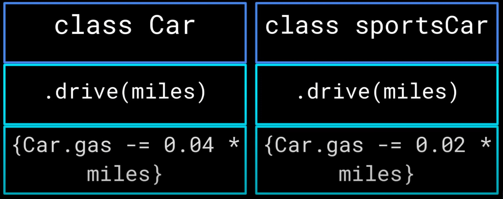
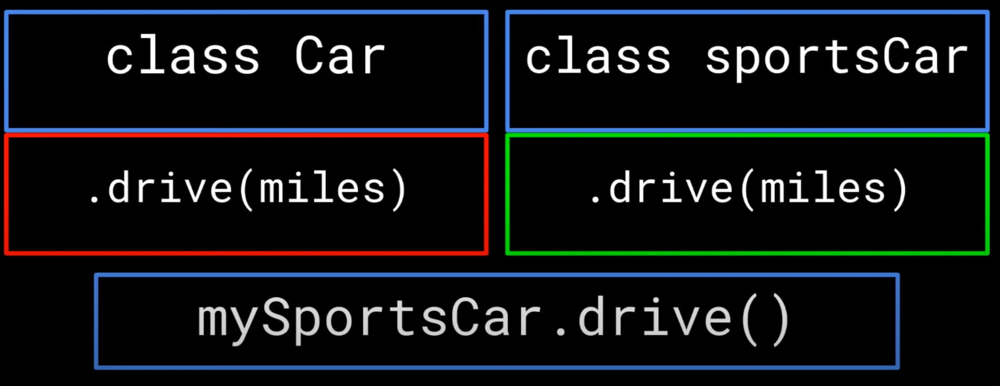
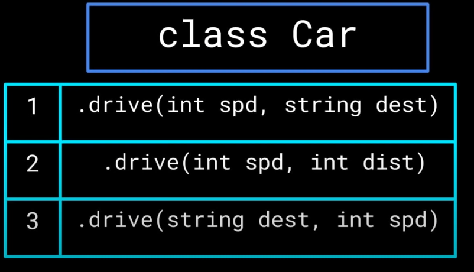

# Polymorphism
## Definition: Polymorphism describes methods with the *same name* that are able to take on many forms
___
## Two Types of Polymorphism
###  Dynamic Polymorphism - Occurs during **runtime**
###  Static Polumorphism - Occurs during **compile time**
___
## Dynamic Polymorphism
Dynamic polymorphism occurs when the program is executed. This type of polymorphism describes when a **method** signature is in both a *subclass* and a *superclass*. 

The method shares the same *name*, same *parameters*, just with different *implementation*. 

### Which method will be called?
This will depend on which class the `object` belongs to. If an `object` of subclass is called, the method implemented by the *subclass* will **override** that of the *superclass*. The implementation of a method signature that will be used is determined dynamically as the program is run. 

### Car Example
We have a *superclass* called `Car` and a *subclass* `SportsCar`. Both classes has a `drive(double miles)` method which the same parameters just different implementations. 

If we have a `SportsCar` object `mySportsCar`, calling `mySportsCar.drive(miles)` will call the `SportsCar`'s implementation of the `drive()` method since it overrides the implementation of its *superclass*. 

### Other Names for Dynamic Polymorphism
* Method Overriding
* Runtime Binding
* Dynamic Binding

### Benefits of Dynamic Polymorphism
This allows us to have a generic implementation of a method in the *superclass* and if we want more specific behavior we can override it in the *subclass*. 

## Static Polymorphism
Static polymorphism occurs during compile time rather than during runtime. This refers to when multiple methods with the same *name* but different *arguments* are defined in the same class. This also refers to when multiple functions (not methods) with same *name* and different *arguments*. 

### Ways to Differentiate Methods of the Same Name
* Different number of parameters
* Different types of parameters
* Different order of parameters
* Different qualifiers (`const` or `volatile`)

### Ways to Differentiate Functions of the Same Name
* Different number of parameters
* Different types of parameters
* Different order of parameters

Note the different between methods and functions.

### Car Example
If we have a `Car` class, the `Car` class can have three methods all called `drive()` with different parameters. Depending on the parameters when `drive()` is called, the `drive()` implementation that has the matching parameters will be called.

### Other Names for Static Polymorphism
* Method Overloading 
* Function Overloading
* Compile Time Binding
* Dynamic Binding

Note: Method/Function overloading can cause trouble if you do not keep straight which parameters you need for which implementation. Using the incorrect arguments **may not** cause an error if it matches that of another form of the method, which can cause issues that can hard to detect. 

## Overview
Overall, polymorphism can be useful since it allows methods with the same name to take on many different forms. When utilizing polymorphism, be sure that you are calling the correct form of the method/function.